# Tether 2.0

## Project overview

Talk-A-Tive is a MERN chat application for direct and group conversations. It combines a React chat interface with an Express and Socket.IO server, and stores accounts, conversations, and messages in MongoDB.

## Features

- Register an account, sign in, and update a profile picture and short bio.
- Find users and start one-to-one conversations.
- Create group chats, rename them, and add or remove members.
- Send messages in real time with typing indicators, unread counts, read status, and notifications.
- Delete your own messages for all chat members and hide conversations from your own chat list.
- Try the guest account, which is limited to three messages.
- Responsive chat layout with Chakra UI components.

## Tech stack

| Area | Technologies |
| --- | --- |
| Frontend | React 17, Create React App, Chakra UI, Axios |
| Backend | Node.js, Express |
| Database | MongoDB, Mongoose |
| Authentication | JSON Web Tokens (JWT), bcryptjs |
| Real-time messaging | Socket.IO server and client |

## Architecture

1. The React single-page app renders the login, registration, and chat views. It calls the Express REST API with Axios and stores the signed-in user's token in browser local storage.
2. Express exposes user, chat, and message routes. Protected routes verify the bearer token, and controllers read and write users, chats, and messages through Mongoose.
3. The HTTP server also hosts Socket.IO. Socket connections authenticate with the same JWT and join a personal room; chat-room membership is checked before a socket can join a conversation.
4. MongoDB persists users, group and direct chats, messages, and guest message counts.

In production, Express can serve the compiled frontend from `frontend/build` as well as the API. The default local frontend development server proxies API requests to `http://127.0.0.1:5000`.

## Folder structure

```text
.
├── Backend/
│   ├── config/          # MongoDB connection, JWT, guest quota
│   ├── controllers/     # User, chat, and message handlers
│   ├── middleware/      # JWT authorization and error handling
│   ├── models/          # User, chat, and message schemas
│   ├── routes/          # REST API routes
│   └── Server.js        # Express and Socket.IO server
├── frontend/
│   ├── public/          # HTML shell and public assets
│   └── src/
│       ├── components/  # Chat, authentication, and shared UI
│       ├── Context/     # Chat and user state
│       ├── Pages/       # Login and chat pages
│       └── config/      # Chat helpers
├── screenshots/         # Current application screenshots
├── .env.example         # Backend environment variable template
└── package.json         # Root scripts and backend dependencies
```

## Authentication

Registration and login return a JWT. Passwords are hashed with bcryptjs before storage; protected API requests send the token as `Authorization: Bearer <token>`. Socket.IO connections send the token in the handshake's `auth.token` field. The browser stores the returned user object in local storage until logout.

The login screen's **Get Guest User Credentials** button fills in `guest@example.com` and `123456`. This repository does not automatically create that account: it must already exist in the MongoDB database for guest login to work.

## Real-time Socket.IO flow

1. After login, the client connects to Socket.IO with its JWT. The server verifies the token and associates the socket with that user.
2. The client emits `setup`; the server joins the user's personal room and replies with `connected`.
3. When a conversation is opened, the client emits `join chat`. The server confirms the user belongs to that chat before joining its room.
4. Typing events (`typing`, `stop typing`) and read-status events (`messages read`) are broadcast to other members of the joined room.
5. A message is first created through the REST API. The client then emits `new message`; the server reloads the saved message, verifies its sender and chat membership, and sends `message recieved` to the other members' personal rooms.
6. Message deletion is persisted through the REST API and announced to each member with `message deleted`.

## Guest message limit

The account with the email `guest@example.com` can send **three messages total**. The server tracks the count in MongoDB, reserves each send atomically, and rejects further sends with HTTP `429` after the quota is used. The chat UI displays the remaining count and disables the composer when it reaches zero. The count is associated with the guest account and is not reset by logging out or reconnecting.

## Screenshots and demo

The application screenshots below use fictional sample users and messages rendered with a temporary, local-only fixture API. No live account or chat data is included.

### Sign in and registration

| Login | Sign up |
| --- | --- |
| 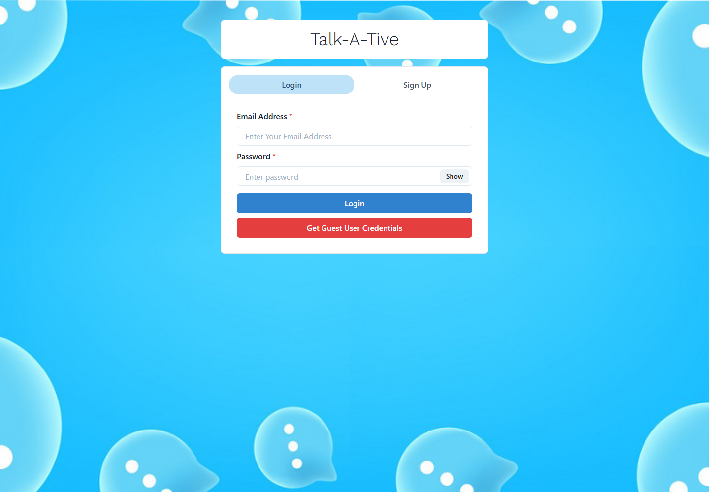 | 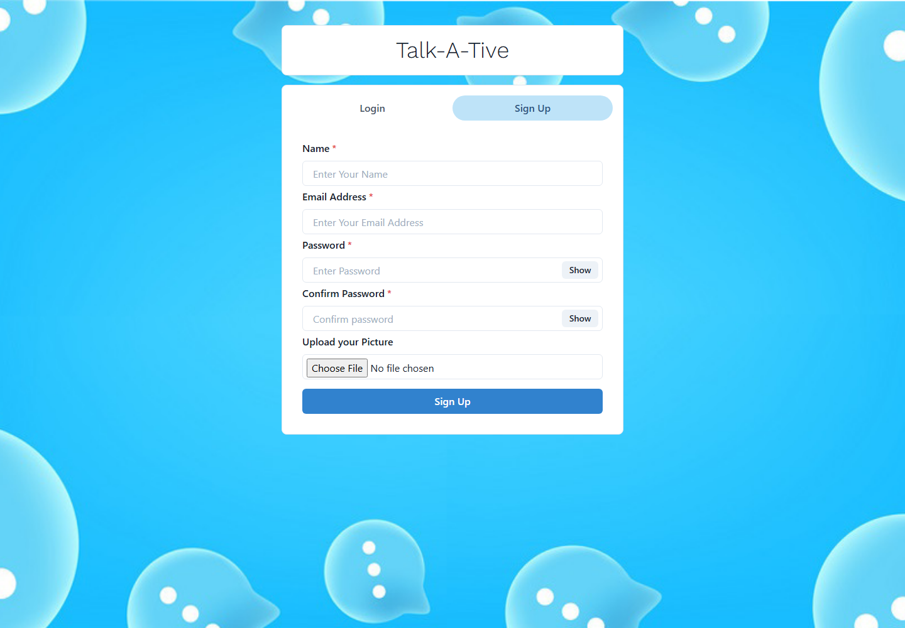 |

### Inbox and messaging

| Chat dashboard | One-to-one conversation |
| --- | --- |
| 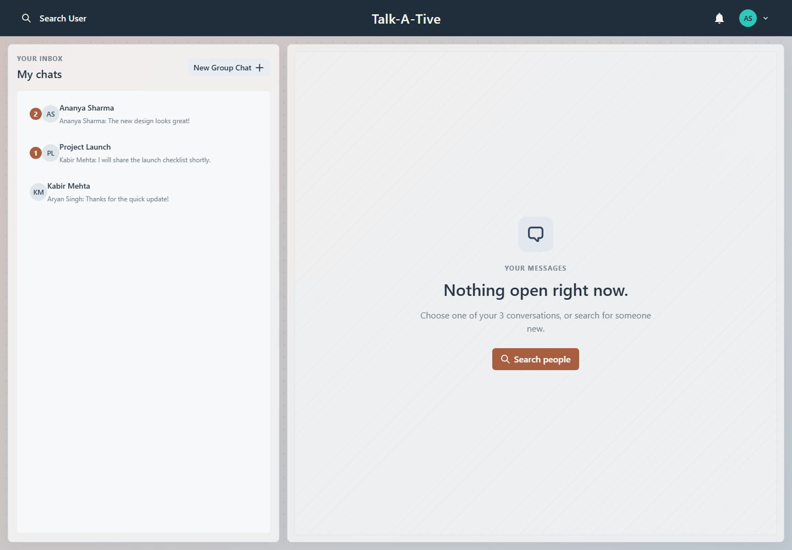 | 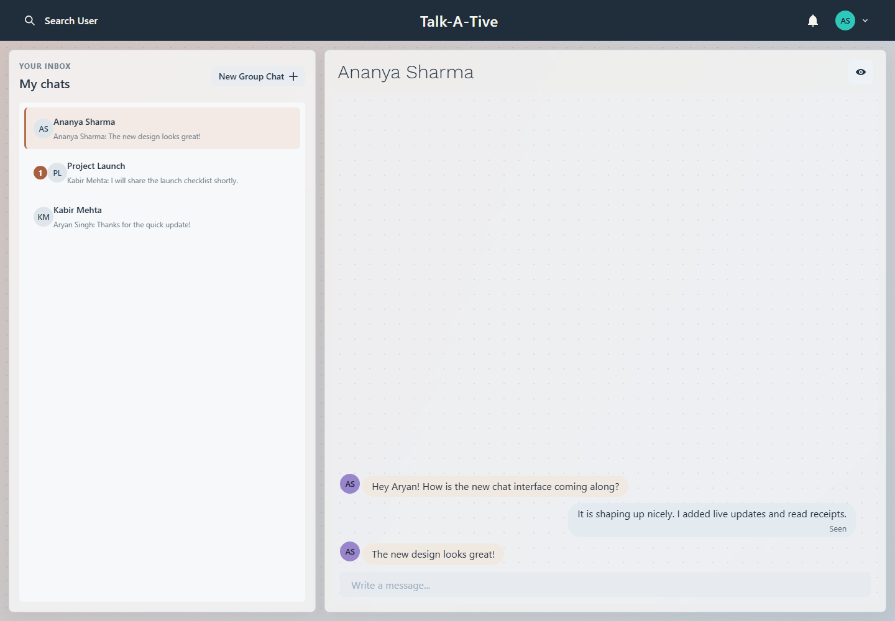 |

### Group conversations

| Group conversation | Create a group |
| --- | --- |
| 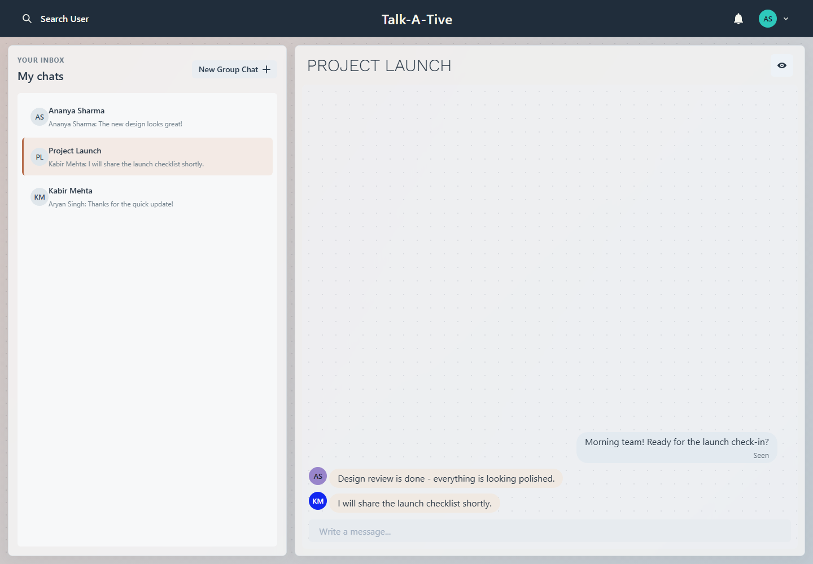 | 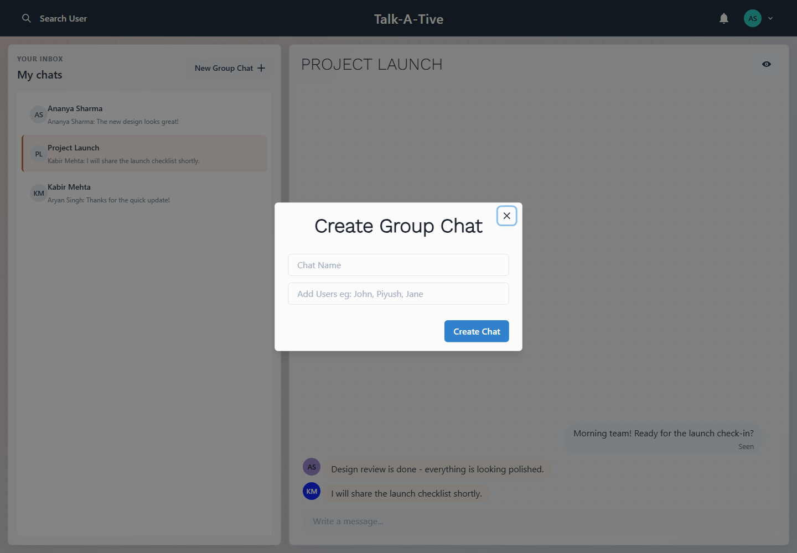 |

| Manage group members |
| --- |
| 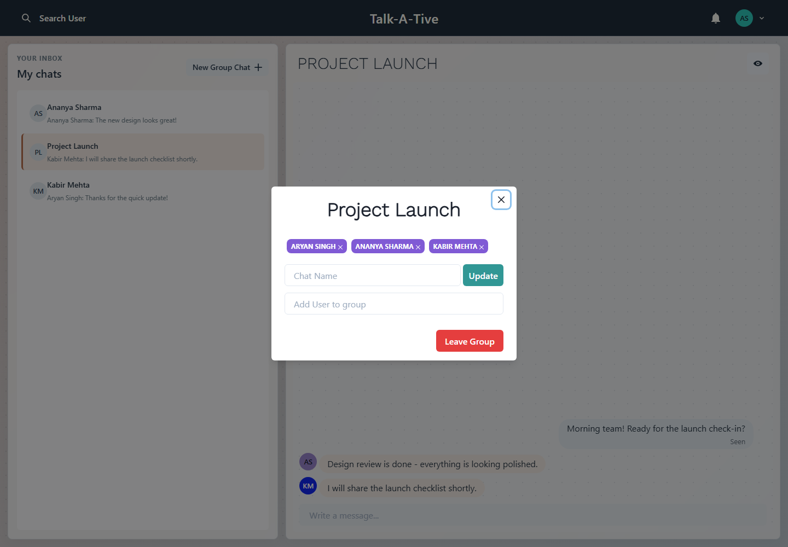 |

### Search and profile

| Find people | View profile |
| --- | --- |
| 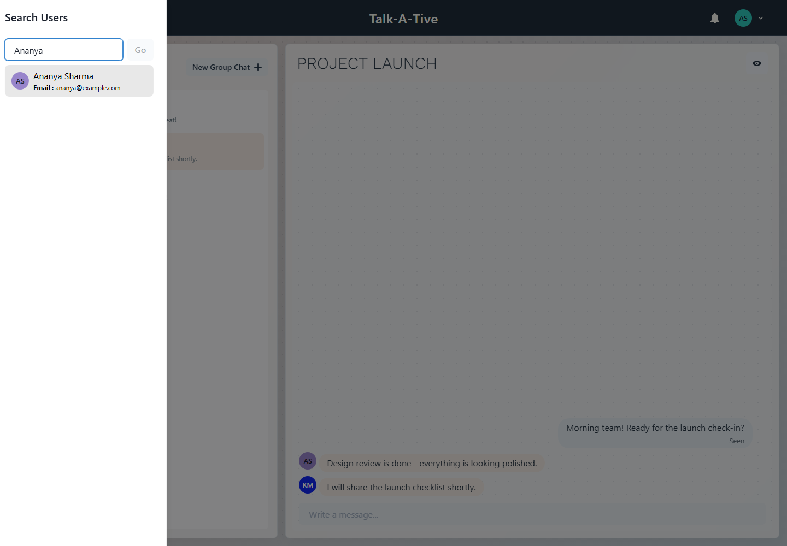 | 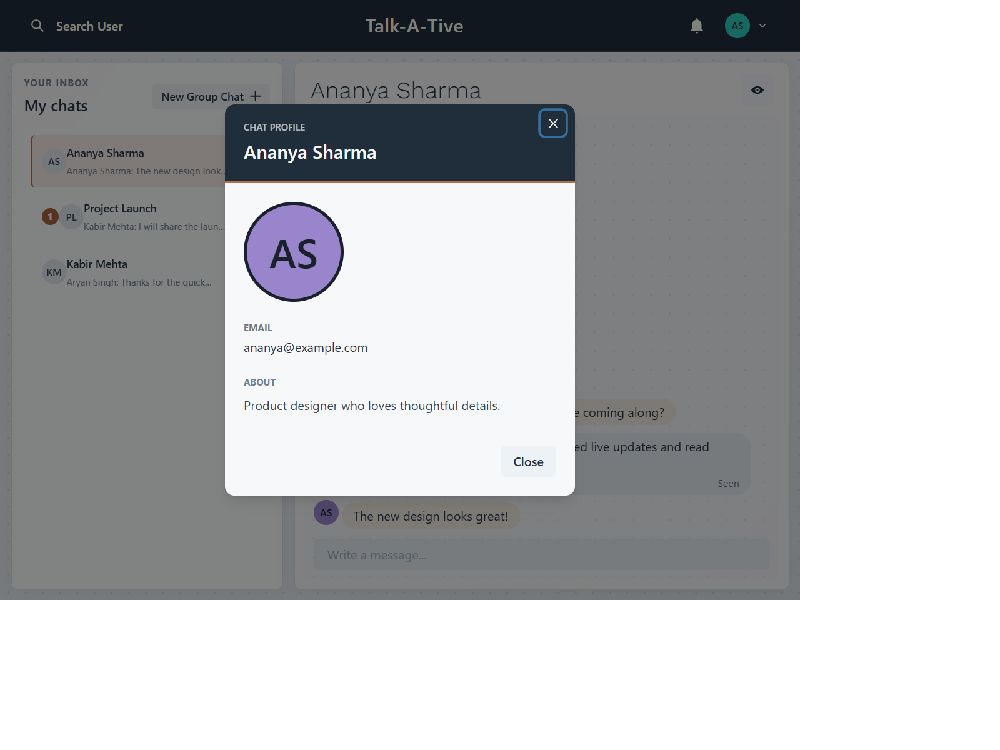 |

| Edit profile | Guest message limit |
| --- | --- |
| 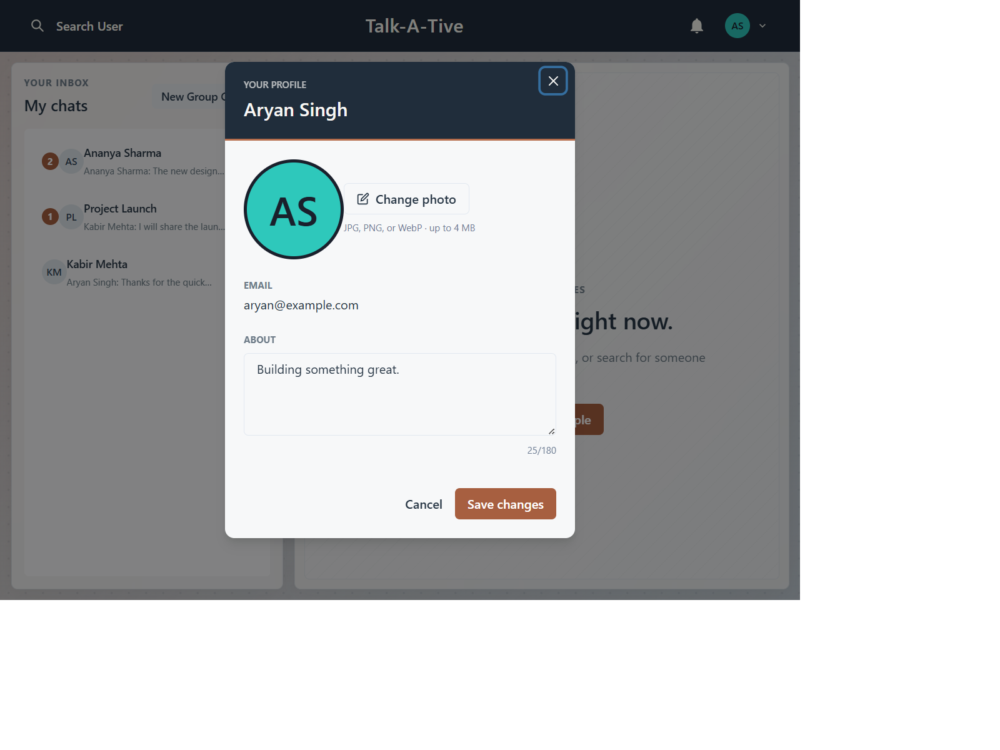 | 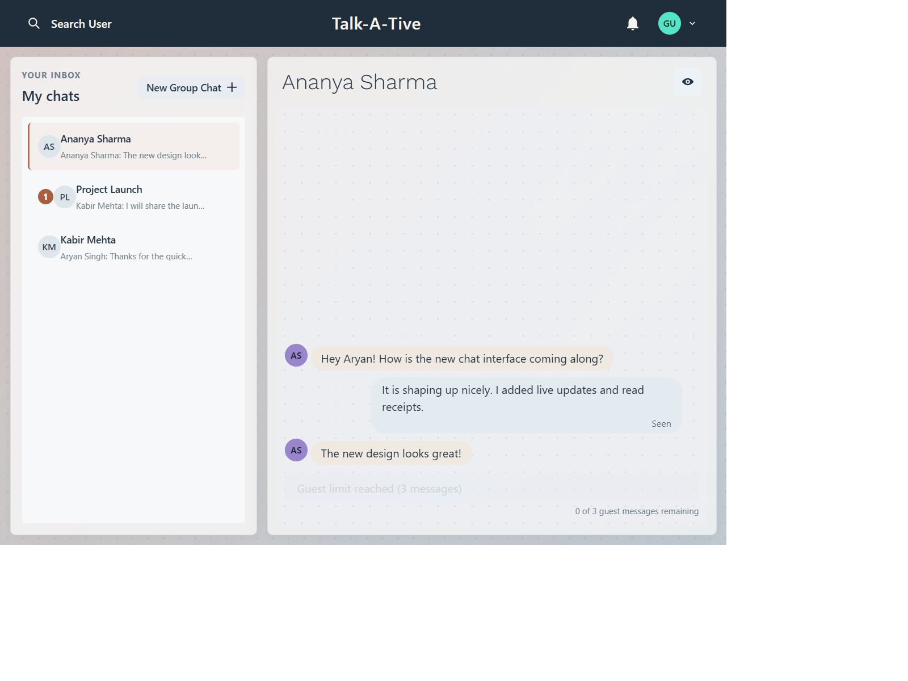 |

A public demo URL is not configured in this repository. Follow the steps below to run the app locally.

## Installation

### Prerequisites

- Node.js and npm
- A MongoDB instance, local or hosted

### Install dependencies

From the project root:

```bash
npm install --legacy-peer-deps
npm install --prefix frontend --legacy-peer-deps
```

## Environment variables

Copy `.env.example` to `.env` in the project root, then set values for your environment:

| Variable | Purpose | Example |
| --- | --- | --- |
| `PORT` | Backend HTTP and Socket.IO port | `5000` |
| `MONGO_URI` | MongoDB connection string | `mongodb://127.0.0.1:27017/chat-app` |
| `JWT_SECRET` | Secret used to sign and verify JWTs | Use a long, private random value |
| `CLIENT_URL` | Allowed frontend origin(s) for Socket.IO; multiple origins can be comma-separated | `http://localhost:3000` |
| `NODE_ENV` | Set to `production` to serve the built frontend | `development` |

For a frontend and backend hosted on different origins, set `REACT_APP_SOCKET_URL` when building the frontend to the backend's Socket.IO origin (for example, `https://api.example.com`). This Create React App variable is embedded at build time. If it is not set, the client uses its built-in endpoint selection.

Do not commit `.env` or put production secrets in frontend variables.

## Running locally

1. Start MongoDB and configure the root `.env`.
2. In one terminal at the project root, start the API and Socket.IO server:

   ```bash
   npm run server
   ```

3. In a second terminal, start the React development server:

   ```bash
   npm run client
   ```

   Or start both with `npm run dev`.

4. Open [http://localhost:3000](http://localhost:3000). The frontend development server proxies `/api` requests to the backend on port `5000`.

To use guest login, first create the guest account (`guest@example.com`, password `123456`) in the database. Otherwise, register a regular user through the sign-up screen.

## Deployment

The backend serves the React build when `NODE_ENV=production`, so the simplest deployment is a single Node.js web service with network access to MongoDB:

1. Configure the service's `MONGO_URI`, a strong `JWT_SECRET`, `CLIENT_URL` (the deployed frontend origin), and `NODE_ENV=production`. Use the platform-provided `PORT`.
2. Build the frontend with `npm run build` from the project root. The generated static app is placed in `frontend/build`.
3. Start the service with `npm start`. Express serves the frontend and the `/api` routes, and Socket.IO shares the same server.
4. If the frontend is hosted separately, configure a build-time `REACT_APP_SOCKET_URL` and route its `/api` requests to the backend as well. The frontend also requires the deployment platform or reverse proxy to support Socket.IO/WebSocket connections.

Keep secrets in the deployment platform's environment settings, not in source control.

## API overview

All endpoints are relative to `/api`. Except registration and login, the routes below require `Authorization: Bearer <token>`.

| Method | Endpoint | Description |
| --- | --- | --- |
| `POST` | `/user` | Register an account |
| `POST` | `/user/login` | Sign in |
| `GET` | `/user?search=<term>` | Search users |
| `PUT` | `/user/profile` | Update the signed-in user's profile |
| `GET` | `/chat` | List the user's visible chats and unread counts |
| `POST` | `/chat` | Find or create a direct chat |
| `POST` | `/chat/group` | Create a group chat |
| `PUT` | `/chat/rename` | Rename a group chat |
| `PUT` | `/chat/groupadd` | Add a user to a group |
| `PUT` | `/chat/groupremove` | Remove a user from a group |
| `DELETE` | `/chat/:chatId` | Hide a chat from the signed-in user's list |
| `GET` | `/message/:chatId` | Load messages for a chat |
| `POST` | `/message` | Send a message |
| `PATCH` | `/message/:chatId/read` | Mark received messages as read |
| `DELETE` | `/message/:messageId` | Delete the signed-in user's message |

## Future improvements

- Add automated backend and frontend tests for authentication, guest quotas, REST endpoints, and Socket.IO events.
- Add password reset, email verification, and configurable guest-account provisioning.
- Add pagination and rate limiting for user search and message history.
- Improve deployment configuration for separate frontend and backend services.
- Add richer message features such as attachments and delivery states.

## Created by

Aryan
